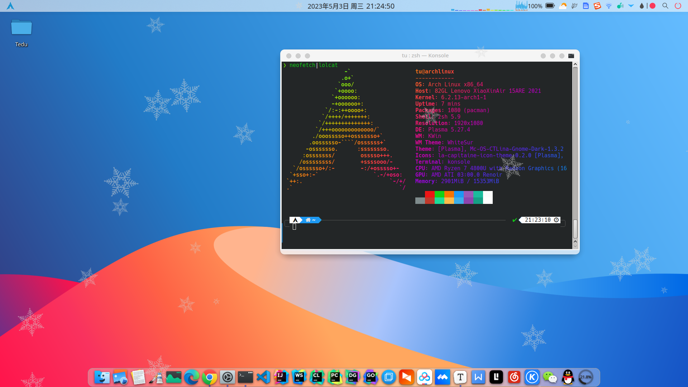

## KDE Plasmoid Snowing

We are delighted to welcome you to the KDE Plasma Snowing plugin! This plugin will bring you a delightful snowflake effect, making your desktop more interesting and beautiful. The KDE Plasma Snowing plugin is an easy-to-use tool that simply adds it to your desktop to make snowflakes dance on your screen. You can customize the color, size, and quantity of snowflakes by adjusting the settings to achieve the best results. Thank you for choosing to use the KDE Plasma Snowing plugin. We hope it will bring you a pleasant user experience! Author: Shu Tu

Support:
* Size, speed, count and style can be changed dynamically

Implementation details:
* Uses special flags of X11 
* Just QML; no additional install instructions required
* Since MouseEvents can't be masked with QML this implementation
is a bit different than what is possible with a QT C++ plugin.

### Install
Should be installable through the KDE Store
You can also copy this repository in ./local/share/plasma/plasmoids/

Here are some screenshots: 

Classic mode

Different snow flake, smaller average size
