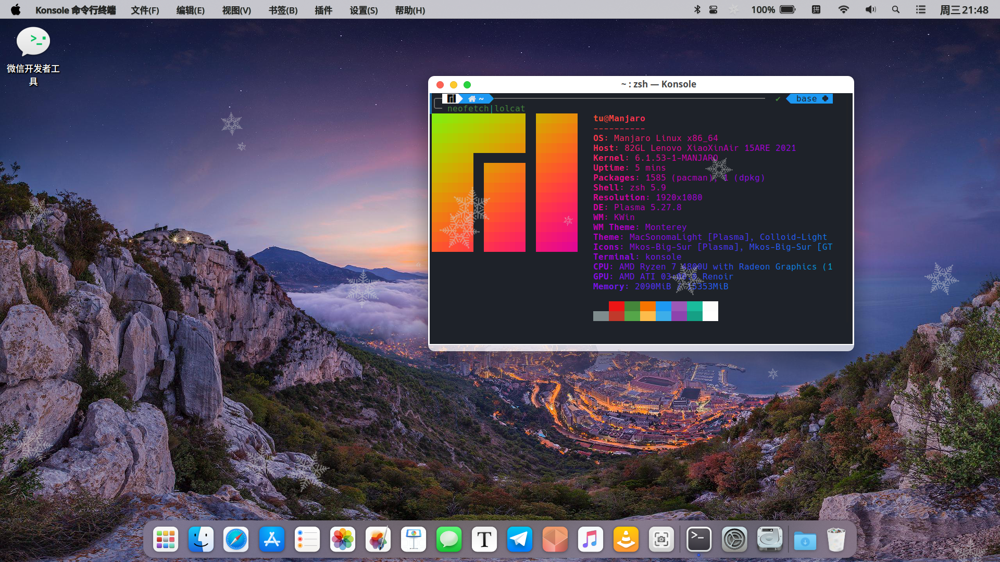

## KDE Plasmoid Snowing

我们很高兴欢迎您使用KDE Plasma Snowing插件！该插件将为您带来令人愉悦的雪花效果，使您的桌面更加有趣和美观。KDE Plasma Snowing插件是一个易于使用的工具，只需将其添加到您的桌面即可使雪花在您的屏幕上跳舞。您可以通过调整设置来自定义雪花的颜色、大小和数量，以达到最佳效果。感谢您选择使用KDE Plasma Snowing插件。我们希望它能为您带来愉快的用户体验！作者：舒途

支持:
* 大小、速度、数量和样式可以动态更改

细节:

- 使用X11的特殊标志 
- 只需QML；无需额外的安装说明
- 由于MouseEvents不能用QML屏蔽此实现
-  与QTC++插件有一点不同。

### 安装
应该可以通过KDE商店安装
您还可以将此存储库复制到./local/share/等离子/等离子/

以下是一些截图：

Classic mode

Different snow flake, smaller average size
